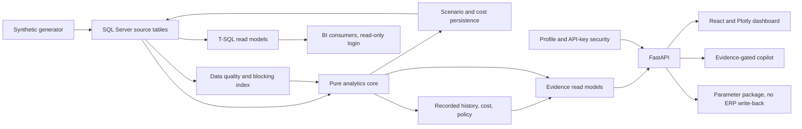

# Architecture

The analytics modules accept DataFrames and return dataclasses or DataFrames. SQL access is isolated in `data_access.py` and `scenario_store.py`. The dashboard service caches one reference comparison per API process and persists its five cases once per matching parameters and seed. Custom scenario runs call the same period engine and append their results. The frontend obtains all visible numbers from the API; chart interactions open the same Evidence Drawer used by cards and rows.

The copilot selects a deterministic tool first. Missing or nonmatching evidence returns a fixed refusal before any language model call. If configured, Anthropic writes a prose explanation from the evidence bundle; the raw bundle remains in the response.

Newer layers reuse the same pattern. `stage_history`, `cost`, `policy` and `parameter_export` are pure functions over DataFrames and engine outputs; only `dashboard.py` and the API attach evidence and touch the database. The T-SQL views in `db/migrations/100_read_models.sql` are the BI-facing twins of three Python metrics, and tests assert parity on a live SQL Server. Persisted runs carry a `data_version` (source-table content fingerprint, analytics code hash and analytical settings) and are reused only when it matches. `security.py` provides a demo profile (no keys, synthetic data only) and a secured profile (start-up validation, reader/operator API keys, least-privilege SQL logins, opt-in external LLM). Integration boundaries are simulated file adapters; see [docs/INTEGRATION.md](docs/INTEGRATION.md). A visual, hoverable version of this page is [docs/architecture.html](docs/architecture.html).
