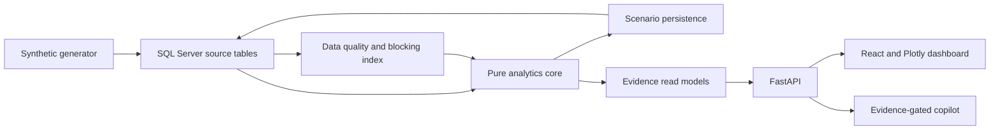

# Architecture

The analytics modules accept DataFrames and return dataclasses or DataFrames. SQL access is isolated in `data_access.py` and `scenario_store.py`. The dashboard service caches one reference comparison per API process and persists its five cases once per matching parameters and seed. Custom scenario runs call the same period engine and append their results. The frontend obtains all visible numbers from the API; chart interactions open the same Evidence Drawer used by cards and rows.

The copilot selects a deterministic tool first. Missing or nonmatching evidence returns a fixed refusal before any language model call. If configured, Anthropic writes a prose explanation from the evidence bundle; the raw bundle remains in the response.
