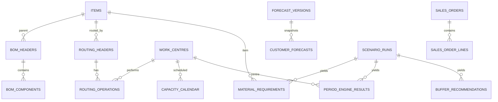

# Data model

The authoritative types and foreign keys are in `db/ddl/001_schema.sql`. This diagram highlights analytical lineage.

Effective dates on BOM and routing versions are part of calculation inputs. `scenario_runs.parameters_json` and `seed` identify the calculation assumptions. `material_requirements` and `period_engine_results` preserve each week's result. Data quality findings are maintained separately so invalid records remain auditable. Source tables are synthetic analogues of ERP/MES data and do not imply a live integration.
