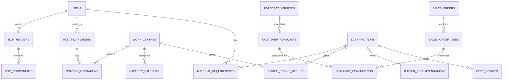

# Data model

The authoritative types and foreign keys are in `db/ddl/001_schema.sql`. This diagram highlights analytical lineage.

Effective dates on BOM and routing versions are part of calculation inputs. `scenario_runs.parameters_json` and `seed` identify the calculation assumptions. `material_requirements` and `period_engine_results` preserve each week's result. Data quality findings are maintained separately so invalid records remain auditable. Source tables are synthetic analogues of ERP/MES data and do not imply a live integration.

Tables added by `db/migrations` (rerunnable, recorded in `schema_migrations`): `cost_results` (one row per run and cost metric; `value` is NULL with status `UNAVAILABLE` when a figure cannot be computed) and `schema_migrations` (name, file hash, applied time). `scenario_runs.data_version` identifies the source data, code and analytical settings a run was computed from; older runs have NULL there and are never reused. `forecast_consumption` is the derived audit trail of which order lines consumed which forecast rows, rewritten each time the read models are built.

Six read-only views serve BI tools: `vw_forecast_revisions`, `vw_forecast_accuracy_by_horizon`, `vw_weekly_load`, `vw_stage_elapsed`, `vw_stage_elapsed_by_work_centre`, `vw_cost_results`. The `pilot_reader_role` can select only these; `pilot_app_role` can write only the result tables (`scenario_runs`, `period_engine_results`, `material_requirements`, `buffer_recommendations`, `cost_results`, `dq_findings`, `forecast_consumption`).
