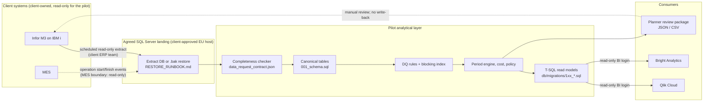

# Integration concept

What runs today is local and simulated: a seeded generator writes canonical CSV files, and the file adapters in `backend/app/integrations/` read and write agreed shapes. No real M3, IBM i, Qlik Cloud, Bright Analytics or MES connection exists or is implied.

This page describes how the same pipeline would connect to the client's systems, once they agree to it.

## Boundaries and ownership

| Boundary | Direction | Owner | Mechanism | Pilot permission |
|---|---|---|---|---|
| M3 to landing database | inbound | Client ERP team | Agreed extract job, or a `.bak` of an extract database | None on M3 itself |
| MES to landing database | inbound | Client MES owner | Operation events (start and finish per MO operation), if M3 does not already hold them | None on the MES |
| Landing to analytical layer | internal | Pilot data engineer | `CsvERPAdapter`, or SQL read with the `pilot_reader` login | `SELECT` only |
| Analytical layer to scenario tables | internal | Pilot application | `pilot_app` login | Insert/update limited to scenario and cost result tables |
| Analytical layer to Qlik Cloud / Bright Analytics | outbound | Client BI team | Read-only views (`vw_*`), or `FileBIExportAdapter` files with a provenance sidecar | `SELECT` on views only |
| Parameter package to M3 | none | Planners | A human reviews the JSON/CSV package | **No write-back** |

**MES boundary.** The pilot consumes operation start and finish events; it never sends anything to the MES. If M3 already stores confirmed operation actuals, those are used and the MES feed is not needed. The MES feed is only a fallback, when M3's timestamps are too coarse.

## Identifiers

- Canonical surrogate keys are local and never exported as business keys.
- Business keys stay stable across refreshes: item number, work-centre code, order number, customer code and site code.
- Pseudonymised customer codes are applied in the landing database before the data reaches the pilot, when the client requires it (see [SECURITY.md](SECURITY.md)).
- Joins across systems use business key plus site. Any MES identifier is mapped once to the MO number and operation.

## Refresh cadence, late data and incremental extraction

- **Cadence:** weekly, after the Monday planning run. A new forecast snapshot is exported at the same time, which builds up revision history.
- **Incremental extraction (proposed):**
  - Transactional tables: rows changed since the last successful watermark, taken from the source's change timestamp. This must be confirmed per table, because not every source table has a reliable one.
  - Master data (items, BOM, routing): full snapshot each run, because it is small and revision history matters.
- **Late data:** records that arrive after the cut-off are loaded in the next cycle. The DQ layer flags period results computed without them. Past periods are never silently rewritten: a rerun is a new `scenario_runs` row with its own data version.
- **Reconciliation:** each load compares row counts and control totals (order quantities, on-hand quantity) against source-side totals the ERP team supplies. A mismatch fails the load.

## Failure and retry

| Failure | Behaviour |
|---|---|
| Extract missing or late | Last good version stays in use. The dashboard shows the data version date, and no partial load is published |
| Completeness checker returns BLOCK | Load stops; the report goes to the ERP team with the failing checks |
| Adapter validation error (bad MES line, missing file) | The whole file is rejected with every problem listed (`AdapterError.problems`); nothing is loaded partially |
| Transient SQL error | Retry 3 times with backoff, then fail the run |
| BI export incomplete | No sidecar means the file is not published; BI keeps the previous export |

## Local vs. client-dependent

| Item | Runs locally now | Needs the client |
|---|---|---|
| Canonical schema, loader, DQ, engine, cost, policy | yes | — |
| Completeness checker against the contract | yes (CSV or SQL) | Real extract |
| File adapters (ERP CSV, BI export, MES events) | yes, simulated | Agreed file specifications |
| T-SQL read models and read-only BI login | yes, local SQL Server | Client BI connectivity |
| `.bak` restore workflow | yes, into a new disposable local database | The client's backup and hosting approval |
| M3 table mapping | hypotheses only | Client schema or vendor documentation |
| EU hosting, encryption at rest, access approvals | documented only | Client infrastructure and legal approval |
